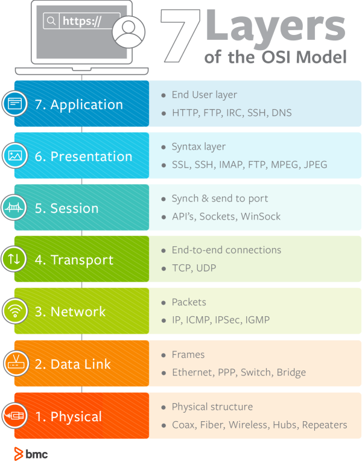

# [OSI STACK]
# NTW01 

## Key terminology
* OSI - Acronym, Open System Interconnection. It states the set of rules for hardware manufacturer and software developers.   
It provides a framework for creating and implementing networking standards, devices, and internetworking schemes. It explains the networking from a modular perspective, making it easier to understand and troubleshoot.
* Encapsulation - How data is moved through the layers from top to bottom when sending.
* Decapsulation - How data is moved through the layers from bottom to top when receiving.
* TTCP/IP - CP/IP stands for Transmission Control Protocol/ Internet Protocol. TCP/IP Stack is specifically designed as a model to offer highly reliable and end-to-end byte stream over an unreliable internetwork.

## Exercise
* The OSI model and its uses.
* The TCP/IP model and its uses.

## Sources
* [OSI 7 Layer Model](https://www.computernetworkingnotes.com/ccna-study-guide/osi-seven-layers-model-explained-with-examples.html)
* [OSI Model](https://www.practicalnetworking.net/series/packet-traveling/osi-model/)
* [OSI Layers](https://www.networkworld.com/article/3239677/the-osi-model-explained-and-how-to-easily-remember-its-7-layers.html)
* [Advantages & Purpose](https://www.computernetworkingnotes.com/ccna-study-guide/osi-model-advantages-and-basic-purpose-explained.html)
* [TCP/IP Model](https://www.javatpoint.com/computer-network-tcp-ip-model)

## Overcome challenges
- None

## Results

## OSI MODEL
The 7 layers helps visualize what is going on within their networks and can help network managers narrow down problems (is it a physical issue or something with the application?),These 7 layers helps in acheiving the end goal of Cmputer to computer communication.

___OSI 7 Layers Explained -___  
### Top Layers
The Session, Presentation, and Application layers of the OSI model handle the final steps before the data transferred through the network (facilitated by layers 1-4) is displayed to the end user.

 #### 7 Application
 - Provide a user interface for sending and receiving data
 #### 6 Presentation
 - 	Encrypt, format, and compress data for transmission
 #### 5 Session
 - Initiate and terminate a session with the remote system

 ### Bottom Layers
 #### 4 Transport
 - Break the data stream into smaller segments and provide reliable and unreliable data delivery.
 - The Transport layer of the OSI model is responsible for distinguishing network streams.
 - At any given time on a user’s computer there might be an Internet browser open, while music is being streamed, while a messenger or chat app is running. Each of these applications are sending and receiving data from the Internet, and all that data is arriving in the form of 1’s and 0’s on to that computer’s NIC.
Something has to exist in order to distinguish which 1’s and 0’s belong to the messenger or the browser or the streaming music. That “something” is Layer 4
- Layer 4 accomplishes this by using an addressing scheme known as Port Numbers.

 #### 3 Network
 - Provide logical addressing
 - The  Network layer of the OSI model is responsible for packet delivery from end to end.
 - It does this by using another addressing scheme that can logically identify every node connected to the Internet. This addressing scheme is known as the Internet Protocol address, or the IP Address.
 - Routers are Network Devices that operate at Layer 3 of the OSI model. A Router’s primary responsibility is to facilitate communication between Networks.

 #### 2 Data Link
  - Prepare data for transmission
  - Layer 2 is responsible for putting 1’s and 0’s on the wire, and pulling 1’s and 0’s from the wire.
  - Layer 2 will then group together those 1’s and 0’s into chunks known as Frames.
  - The Network Interface Card (NIC) that you plug your Ethernet wire into handles the Layer 2 functionality. It receives signals from the wire, and transmits signals on to the wire. Your WiFi NIC works the same way, receiving and transmitting radio waves which are then interpreted as a series of 1’s and 0’s.
  - The role of Layer 2 is to deliver packets from hop to hop
 #### 1 Physical
 - Move data between devices
  - Layer 1 is anything that carries 1’s and 0’s between two nodes.
  - The actual format of the data on the “wire” can vary with each medium. In the case of Ethernet, bits are transferred in the form of electric pulses. In the case of Wifi, bits are transferred in the form of radio waves. In the case of Fiber, bits are transferred in the form of pulses of light.
  - Repeaters and Hubs also operate at this level
  - 
## OSI Model Uses / Advantages
- To standardize data networking protocols to allow communication between all networking devices across the entire planet.
- To help network administrators by dividing large data exchange process into smaller segments. Smaller segments are easier to understand, manage and troubleshoot.
- The model supports connectionless, as well as connection-oriented, services. 
- It has the flexibility to adapt to many protocols

## TCP/IP 
The TCP/IP model is a concise version of the OSI model. The TCP/IP model was developed prior to the OSI model. It contains five layers, unlike seven layers in the OSI model. The layers are:

1. Process/Application Layer
 - An application layer is the topmost layer in the TCP/IP model.
- It is responsible for handling high-level protocols, issues of representation.
- This layer allows the user to interact with the application.
- Main protocols used in this layer are, HTTP, SNMP, FTP, SMTP, DNS, TELNET

1. Host-to-Host/Transport Layer
-  The transport layer is responsible for the reliability, flow control, and correction of data which is being sent over the network.

1. Internet Layer
- 
1. Network Access/Link Layer
- It defines how the data should be sent physically through the network.
- This layer is mainly responsible for the transmission of the data between two devices on the same network.An internet layer is the second layer of the TCP/IP model.
- The main responsibility of the internet layer is to send the packets from any network, and they arrive at the destination irrespective of the route they take.
- Following are the protocols used in this layer are:
### Ip Protocol 
#### Resposiblities -
- IP Addressing: This protocol implements the logical host addresses known as IP addresses
- Host-to-host communication: Determines the path through which the data has to be transmitted.
-  Data Encapsulation and Formatting: encapsulates the data into message known as IP datagram.
- Fragmentation and Reassembly: The limit imposed on the size of the IP datagram by data link layer protocol is known as Maximum Transmission unit (MTU). If the size of IP datagram is greater than the MTU unit, then the IP protocol splits the datagram into smaller units so that they can travel over the local network.
-  Routing: When IP datagram is sent over the same local network such as LAN, MAN, WAN, it is known as direct delivery. 
### ARP Protocol - 
 -  ARP stands for Address Resolution Protocol.
- ARP is a network layer protocol which is used to find the physical address from the IP address.

### ICMP Protocol

- ICMP stands for Internet Control Message Protocol.
- It is used by the hosts or routers to send notifications regarding datagram problems back to the sender.

## TCP/IP Uses and Advantages
TCP/IP Model helps you to determine how a specific computer should be connected to the internet and how data should be transmitted between them. It helps you to create a virtual network when multiple computer networks are connected together. The purpose of TCP/IP model is to allow communication over large distances.

## Reference Images

